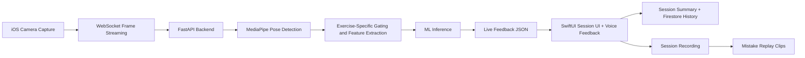

# FiT-AI Trainer

FiT-AI Trainer is an iOS fitness coaching application that gives users real-time workout feedback using computer vision and machine learning. The app streams camera frames to a Python backend, detects human pose landmarks, evaluates exercise form, counts reps or hold time, and returns live guidance while the user is exercising.

Originally developed as a Software Engineering senior project at Kasetsart University, FiT-AI Trainer focuses on making guided workouts more accessible for people exercising without a personal trainer.

## What the app does

FiT-AI Trainer helps users work out more safely and consistently by acting like a lightweight AI workout coach. During a session, the system:

- watches the user through the camera
- checks whether the full body and exercise setup are visible
- analyzes movement or hold posture in real time
- gives immediate on-screen and spoken feedback
- counts correct reps for dynamic exercises
- tracks correct hold duration for isometric exercises
- saves the completed session to workout history
- lets the user replay short clips around mistake timestamps

## Key features

- Real-time form feedback for `Squat`, `Lunges`, `Plank`, and `Wall-Sit`
- Rep counting for movement-based exercises such as squats and lunges
- Hold-time tracking for isometric exercises such as plank and wall-sit
- Guided setup feedback such as camera framing, visibility, and ready-state checks
- Voice coaching through text-to-speech during active sessions
- Structured workout programs with multi-exercise flow
- Session summary with workout duration, calories, and per-exercise performance
- Mistake timeline with short replay clips generated from recorded session video
- User authentication with Google Sign-In and Sign in with Apple
- User profile storage and workout history using Firebase Firestore
- Weekly progress view with calories burned and session history

## Supported exercises

| Exercise | Type | Camera orientation | Current tracking |
| --- | --- | --- | --- |
| Wall-Sit | Isometric | Side view | Hold duration, posture correctness, mistake timestamps |
| Squat | Dynamic | Front view | Correct reps, incorrect reps, form issues, mistake timestamps |
| Plank | Isometric | Side view | Hold duration, posture correctness, mistake timestamps |
| Lunges | Dynamic | Side view | Correct reps, incorrect reps, form issues, mistake timestamps |

## How it works



### End-to-end session flow

1. The user signs in, chooses a workout program, and starts a session in the iOS app.
2. The app opens the camera, records the session locally, and streams JPEG frames over WebSocket.
3. The backend receives the frames, runs MediaPipe pose estimation, and checks whether the user is positioned correctly for the selected exercise.
4. Exercise-specific feature extraction converts pose landmarks into a model-friendly representation.
5. The backend runs ML inference and sends status or prediction messages back to the app.
6. The app updates the UI, speaks feedback aloud, and tracks progress such as reps or hold time.
7. When the session ends, the app stores a structured summary in Firestore and keeps the local recording for mistake replay.

## ML and backend approach

FiT-AI Trainer uses different inference strategies depending on exercise type:

- `Squat` and `Lunges` use phase-aware temporal models based on TCN-style sequence processing.
- `Plank` and `Wall-Sit` use handcrafted pose features with Logistic Regression-style posture classification.
- MediaPipe is used to extract body landmarks from live video frames.
- Shared backend utilities handle session state, gating, status messages, feature normalization, and model loading across exercises.

At the code level, the backend currently contains:

- a unified FastAPI app in `backend/main.py`
- per-exercise WebSocket endpoints under `/{exercise}/ws/video`
- health endpoints for global and per-exercise readiness checks
- reusable streaming/session utilities under `backend/shared`
- automated tests for backend sessions, model services, and WebSocket flows

## User experience flow

From the app user's perspective, the typical journey is:

1. Sign in with Google or Apple
2. Edit profile information
3. Pick a workout program
4. Review the included exercises
5. Start a camera-based live workout session
6. Receive real-time visual and spoken coaching
7. Review the final result summary
8. Revisit past sessions in the Progress screen
9. Replay short clips around form mistakes

## Example feedback the app can surface

Depending on exercise and prediction output, the app can surface issues such as:

- `Feet too close`
- `Knees in`
- `Round back`
- `Torso lean forward`
- `Knee over toe`
- `Not deep enough`
- `Stand too wide`
- `Adjust your camera`
- `Adjust your lights`

## Tech stack

### Frontend

- `SwiftUI` for the iOS interface
- `AVFoundation` for camera capture and local session recording
- `URLSessionWebSocketTask` for live backend communication
- `Charts` for weekly progress visualization
- `Firebase Auth` for authentication
- `Firebase Firestore` for user profile and workout history persistence
- `GoogleSignIn` and `AuthenticationServices` for OAuth flows

### Backend

- `Python`
- `FastAPI`
- `Uvicorn`
- `MediaPipe`
- `OpenCV`
- `NumPy`
- `scikit-learn`
- `PyTorch` for temporal models
- `pytest` for backend test coverage

## Repository structure

```text
FiT-AI/
├── backend/
│   ├── main.py
│   ├── shared/
│   ├── squat/
│   ├── plank/
│   ├── lunges/
│   ├── wall_sit/
│   └── tests/
├── frontend/
│   └── frontend.xcodeproj
└── README.md
```

## Getting started

### 1. Backend setup

Run the unified streaming backend from the `backend` directory:

```bash
cd backend
python3 -m venv .venv
source .venv/bin/activate
python -m pip install --upgrade pip setuptools wheel
pip install -r requirements.base.txt
pip install -r requirements.ml.txt
pip install torch --index-url https://download.pytorch.org/whl/cpu
uvicorn main:app --host 0.0.0.0 --port 7860 --reload
```

Health check:

```bash
curl http://localhost:7860/health
```

Per-exercise WebSocket endpoints:

- `ws://localhost:7860/squat/ws/video`
- `ws://localhost:7860/plank/ws/video`
- `ws://localhost:7860/lunges/ws/video`
- `ws://localhost:7860/wall_sit/ws/video`

### 2. iOS app setup

Open the Xcode project:

```bash
open frontend/frontend.xcodeproj
```

Before running the app, make sure you provide:

- a valid `GoogleService-Info.plist` for your Firebase project
- Firebase Auth providers configured for Google and Apple sign-in
- Firestore enabled for `users` and `workoutSessions`
- app configuration values for the backend WebSocket URLs

The app expects these configuration keys:

- `WALL_SIT_WS_URL`
- `SQUAT_WS_URL`
- `PLANK_WS_URL`
- `LUNGES_WS_URL`

Example values when using the unified local backend:

```text
WALL_SIT_WS_URL = ws://localhost:7860/wall_sit/ws/video
SQUAT_WS_URL    = ws://localhost:7860/squat/ws/video
PLANK_WS_URL    = ws://localhost:7860/plank/ws/video
LUNGES_WS_URL   = ws://localhost:7860/lunges/ws/video
```

### 3. Firebase data model

The app currently uses Firestore for:

- `users/{uid}` for profile information
- `workoutSessions/{documentId}` for completed session summaries

If Firestore asks for a composite index while loading workout history, create the suggested index for the `workoutSessions` query used by the app.

## Running tests

From `backend/`:

```bash
pytest
```

The repository also includes an end-to-end WebSocket API test script:

```bash
python tests/api/test_api.py
```

This script checks health endpoints, WebSocket session startup, frame streaming, and several edge cases across all supported exercises.

## Deployment notes

The backend includes Docker support:

- `backend/Dockerfile` for containerized backend services
- `backend/docker-compose.yml` for per-exercise service deployment
- `backend/Dockerfile.hf` for a unified app deployment flow

Because the iOS app reads per-exercise WebSocket URLs from configuration, it can be pointed at either:

- a single unified backend
- separately deployed exercise services

## Project status

FiT-AI Trainer is already beyond the original single-exercise prototype described in the old README. The current codebase includes:

- a production-style SwiftUI mobile client
- four supported exercise modes
- live camera streaming and feedback
- authentication and persistence
- result summaries and replayable mistake clips

This README reflects the implemented state of the repository today rather than the earlier squat-only prototype.

## Authors

- Pichayanon Toojinda
- Yasatsawin Kuldejtitipun
